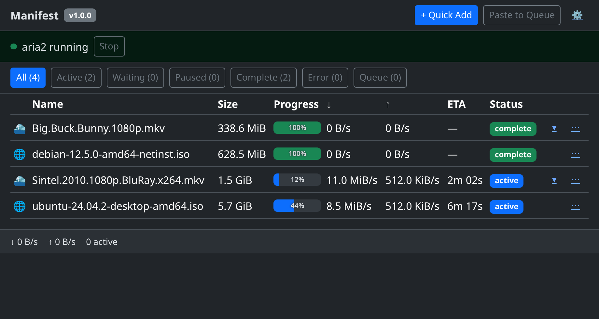
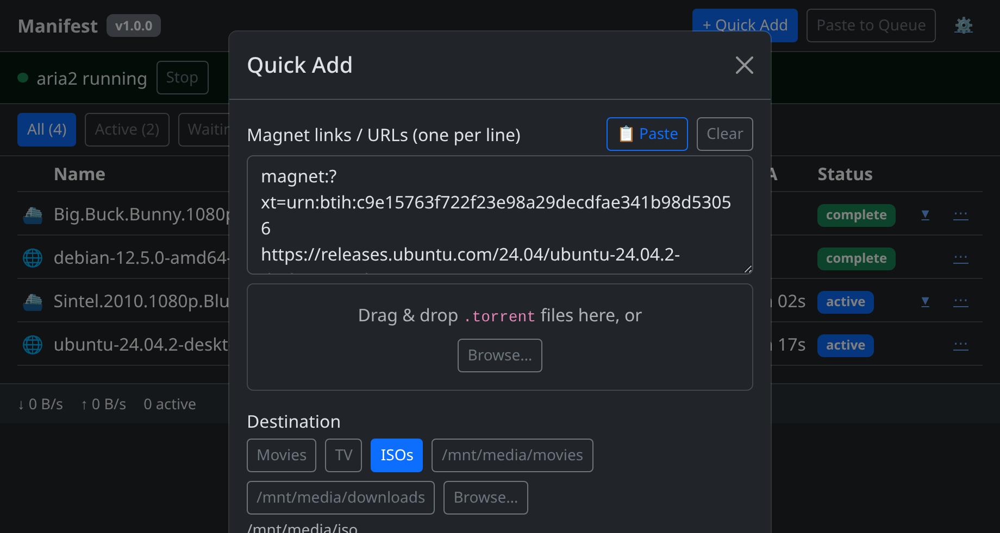
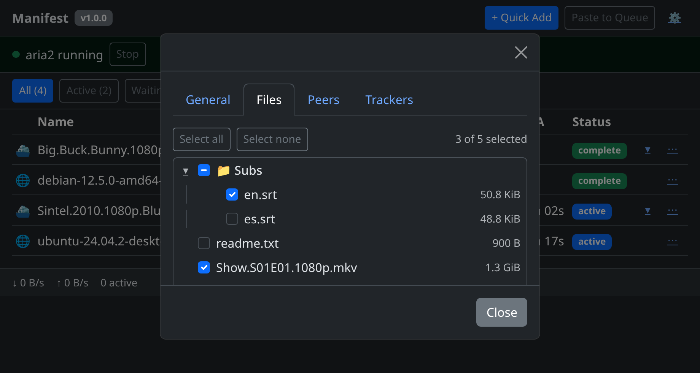
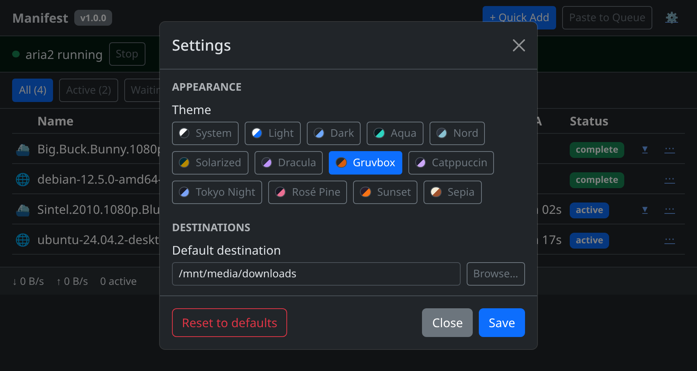

# Manifest

A Cockpit plugin that turnkey-provisions and drives a per-user `aria2c` daemon,
giving the server one unified download station for torrents, magnets, and
HTTP/FTP/Metalink files, all inside the Cockpit console. Pure HTML/CSS/JS,
**no build step**, no server daemon of its own.

> **🗂️ Another Cockpit plugin of mine:** [**Explorer**](https://github.com/ismetozalp/explorer)
> (`ismetozalp/explorer`) — a full file manager for the Cockpit console. Manifest
> deep-links straight into it (and Cockpit's built-in **Files**) with "Open folder".
>
> **📊 And:** [**ctop**](https://github.com/ismetozalp/ctop) (`ismetozalp/ctop`) —
> a live system / process monitor for the Cockpit console.
>
> **📺 And:** [**InFlight TV**](https://github.com/ismetozalp/iftv) (`ismetozalp/iftv`) —
> an IPTV / live-TV player for the Cockpit console.



## What it does

Manifest appears under **Tools → Manifest** in Cockpit. It manages an
`aria2c` process as a per-user `systemctl --user` unit, and drives it entirely
over its JSON-RPC interface via the Cockpit bridge — the browser never talks
to aria2 directly. Adding, pausing, resuming, and removing downloads, queueing
torrents/magnets/HTTP links, and inspecting torrent detail (files, peers,
trackers) are all done from a single full-width table view — there is no
plugin-internal sidebar; Cockpit's own left nav is the only one.

## Features

- **Full-depth torrent support** — General/Files/Peers/Trackers detail tabs,
  per-file selection before or after start, magnet metadata fetch.
- **Two ways to add downloads** — a single-item **Quick Add** (auto-detects
  magnet / HTTP / FTP / Metalink / `.torrent`, base64-safe through the bridge)
  and a **Paste-to-Queue** staging area for adding many mixed sources at once
  with a shared destination/configure-on-start step.
- **No plugin-internal sidebar** — full-width, single-column layout; filters
  are a horizontal pill row; detail, settings, and add flows are modals or an
  inline panel, never a second side rail.
- **Per-user runtime** — aria2 runs as your own `systemctl --user` unit, with
  its own config, session, and RPC port under `~/.config/cockpit/manifest/`.
  It never touches or clobbers any aria2 instance you already run yourself.
- **13 themes** — System, Light, Dark, Aqua, Nord, Solarized, Dracula, Gruvbox,
  Catppuccin, Tokyo Night, Rosé Pine, Sunset, and Sepia — picked in
  Settings → Appearance and applied live, with accent-coloured buttons per theme.
- **Settings that live-apply** — concurrency/connection tuning is pushed to
  the running aria2 daemon via `changeGlobalOption` as you save, with the
  remainder (seed ratio/time, min split size, etc.) taking effect on new
  downloads.
- **In-UI self-update** — a version badge checks the configured GitHub repo's
  latest release and can install it without leaving Cockpit.

## Screenshots

> Mockups with placeholder data — generic paths (`/mnt/media/…`) and
> open-content names (Ubuntu/Debian ISOs, Blender open movies). Not real content.

**Unified download station** — one full-width table for torrents, magnets, and
HTTP/FTP; live progress (percent on the bar), ↓/↑ speeds, ETA, and per-row actions.


**Quick Add** — auto-detects the source (magnet / URL / `.torrent` / Metalink);
tick **Choose files first** to pick torrent files before it starts.



**Per-file selection** — a collapsible checkbox tree with folder tri-state, at
add-time (Quick Add / Paste-to-Queue) or anytime from a torrent's detail view.



**Settings & themes** — live-applied concurrency/connection tuning, saved
destination bookmarks, and 13 themes with colour swatches.



## Requirements

- Cockpit ≥ 300 (the `requires.cockpit` floor in `manifest.json`)
- `aria2` — auto-installed by the plugin's Setup flow (one root/superuser
  step; everything else the plugin does afterward is unprivileged)

## Installing Cockpit itself

If Cockpit isn't already enabled on the host, install and enable it first —
this is separate from installing the Manifest plugin.

```bash
# Fedora / RHEL / CentOS / Rocky / Alma (dnf)
sudo dnf install -y cockpit
sudo systemctl enable --now cockpit.socket

# Debian / Ubuntu (apt)
sudo apt install -y cockpit
sudo systemctl enable --now cockpit.socket

# Arch (pacman)
sudo pacman -S --noconfirm cockpit
sudo systemctl enable --now cockpit.socket

# openSUSE / SLE (zypper)
sudo zypper install -y cockpit
sudo systemctl enable --now cockpit.socket
```

Then open `https://<host>:9090` and log in with a local user account.

## Installing the plugin

Three equivalent ways to get Manifest onto the host, in order of convenience:

**1. From a checkout / source tree:**

```bash
sudo make install
sudo systemctl try-restart cockpit
```

**2. From a release zip** (no checkout needed):

```bash
# Grab the latest manifest-<version>.zip from the Releases page:
#   https://github.com/ismetozalp/manifest/releases/latest
# (or with the gh CLI:  gh release download --repo ismetozalp/manifest --pattern 'manifest-*.zip')
unzip manifest-*.zip -d /tmp/manifest-install
sudo make -C /tmp/manifest-install/manifest install
sudo systemctl try-restart cockpit
```

**3. In-UI self-update** — once any version of Manifest is installed, open it
in Cockpit; the version badge in the top bar checks the configured repo's
latest GitHub release and, if newer, installing is one click away (see
[Self-update](#self-update) below). This is the easiest way to move to a new
version after the first install.

`make install` copies the plugin into `/usr/share/cockpit/manifest` and
records the installed version at `/etc/cockpit/manifest/installed-version`.

## aria2 provisioning

The plugin does not assume aria2 is present — it detects it, and if missing,
walks you through installing it the first time you open Manifest (Setup):

- **Turnkey path** — the plugin probes the host's package manager (`dnf`,
  `apt`, `pacman`, `zypper`, …) and offers to run the matching install
  command as a single superuser step (e.g. `dnf install -y aria2`).
- **RHEL family / EPEL** — on RHEL, CentOS, Rocky, and Alma, `aria2` lives in
  EPEL, not the base repos. If EPEL isn't already enabled, Setup will offer
  to enable it (`dnf install -y epel-release`) before installing `aria2`.
- **Static-binary fallback** — if no supported package manager is found (or
  the install fails, e.g. an offline/air-gapped host), Setup falls back to
  fetching a static `aria2c` binary and installing it under the plugin's own
  state directory, so a working daemon is still available without a system
  package.

After installation, aria2 is configured and run entirely as **your own user**
— a per-user `systemctl --user` unit (`manifest-aria2.service`), its own
RPC port (auto-picked from 16800–26800, never the aria2 default of 6800),
and its own config/session files. No further root access is needed for
day-to-day use.

## Where settings live

All Manifest state is per-user, under `$HOME/.config/cockpit/manifest/`:

| File | Purpose |
|---|---|
| `aria2.conf` | Generated aria2 daemon configuration (port, secret, session path, tuning) |
| `aria2.session` | aria2's persisted download session (resumable on restart) |
| `settings.yml` | Manifest settings — theme, RPC port/poll interval, limits, bookmarks, recents, update repo |
| `queue.json` | Staged (not-yet-started) download queue from Paste-to-Queue |

System-level files (root-owned, written by `make install` / self-update):

| Path | Purpose |
|---|---|
| `/usr/share/cockpit/manifest/` | Installed plugin files |
| `/etc/cockpit/manifest/installed-version` | Version recorded by `make install` |

## Self-update

The top bar shows a version badge: grey normally, and green
(`↑ Manifest vX.Y.Z`) when the configured GitHub repo (`settings.yml` →
`update.repo`, editable in Settings → Updates) has a newer release than the
one installed. Since the browser's CSP only allows `connect-src 'self'`, the
release check does **not** call `github.com` from the page — it goes through
the Cockpit bridge, running `curl` server-side (`FS.spawn(['curl', …])`) to
fetch the GitHub releases API and compare the tag against the installed
version.

Clicking the badge opens an update dialog with a "Reset Manifest settings to
defaults" checkbox, then, once you click "Install update":

1. Downloads the release zip via the bridge (`curl`) to a temp directory.
2. Unpacks it (`unzip`) and runs `make install` in it as **superuser**
   (`FS.spawn([...], { admin: true })`) — the same one root step as a fresh
   install, this time targeting the existing `/usr/share/cockpit/manifest`.
3. Optionally clears `~/.config/cockpit/manifest/` first, if you checked
   "reset settings" in the dialog.
4. Restarts Cockpit via a **detached** `systemd-run --no-block` unit so the
   restart survives the page's own connection dropping, and prompts you to
   hard-reload.

The same dialog switches to a log pane and streams each step's output as the
update runs. A failed install leaves the previous version running untouched
— `make install` only replaces the target directory after the new files are
staged, so there's no half-applied state.

Only the plugin-file install step needs root; the aria2 runtime itself stays
per-user and is never touched by the update beyond what you explicitly
choose to reset.

## Release / development

```bash
make version    # print current version (from VERSION)
make zip        # produce manifest-<version>.zip
make publish    # zip + create/update a GitHub release via `gh`
make uninstall  # remove the installed plugin (use sudo)
```

Unit tests (`node --test`), a Playwright smoke test through the live Cockpit
shell, and a Playwright e2e flow live under `tests/`; see `package.json` for
the `test:unit` / `test:smoke` / `test:e2e` scripts. None of `tests/`,
`docs/`, `node_modules/`, or `package.json` are shipped in the release zip.
